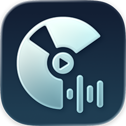

<p align="center">
  
</p>

<h1 align="center">FineTune</h1>

<p align="center">
  <strong>macOS volume control for individual apps</strong> — A free, open-source Mac audio mixer that lets you set per-app volume levels, route applications to different output devices, and apply a 10-band equalizer from your menu bar.
</p>

<p align="center">
  <a href="LICENSE"></a>
  <a href="https://www.apple.com/macos/"></a>
  <a href="https://brew.sh/"></a>
  <a href="https://github.com/ronitsingh10/FineTune/releases"></a>
</p>

<p align="center">
  <em>The volume mixer macOS should have built in.</em>
</p>

---


## Features: Per-App Volume Control & More

- **Per-app volume control** — Individual volume sliders with mute for each application
- **Per-device volume control** — Adjust volume levels for each output device
- **Audio routing** — Route apps to different output devices, or follow "System Audio" to track macOS default
- **Sound effects routing** — Route system alerts, notifications, and Siri to a specific device
- **10-band equalizer** — Fine-tune your sound with 20 presets across 5 categories
- **Real-time VU meters** — Visual feedback for audio levels
- **Volume boost** — Amplify quiet apps up to 400%, click percentage to type exact value
- **Quick device switching** — Change output devices instantly with smart reconnection handling
- **Settings panel** — Launch at login, 4 menu bar icon styles, configurable default volume and max boost
- **App launcher** — Click any app icon to bring it to front
- **Persistent settings** — Your preferences survive app restarts

## Installation

### Homebrew (Recommended)

```bash
brew install --cask finetune
```

### Manual Download

**[Download from GitHub Releases](https://github.com/ronitsingh10/FineTune/releases/latest)**

## Why FineTune?

macOS has no built-in way to control volume per application. You're stuck with one master volume for everything — your video call is too quiet while your music is too loud, or a game drowns out your podcast.

FineTune gives you the control that should have been there all along:

- **Individual volumes** — Turn down Slack notifications without touching your music
- **Audio routing** — Send your video call to headphones while music plays on speakers
- **Quick EQ** — Boost bass or apply presets without third-party audio plugins
- **Free & open source** — No subscriptions, no freemium limitations

## System Requirements

- macOS 14.0 (Sonoma) or later
- Audio capture permission (prompted on first launch)

## How macOS Audio Control Works

FineTune uses macOS Core Audio process taps to intercept and modify audio streams before they reach your output devices. This allows precise control without affecting the source applications.

The app runs as a lightweight menu bar utility, only processing audio for apps you're actively controlling.

## Troubleshooting

**App not appearing in the list?**
Only apps actively playing audio will show up. Start playback, then check FineTune.

**Volume slider not working for an app?**
Some apps use helper processes for audio. Try quitting and reopening the app.

**Audio permission prompt?**
FineTune needs audio capture access to intercept app audio. Grant permission in System Settings → Privacy & Security → Audio Capture.

**No sound after selecting a device?**
Verify the device is working in System Settings → Sound. Some USB/Bluetooth devices need a moment to initialize.

**Audio glitches or crackling?**
This can happen with high CPU load. Close unnecessary apps or check if another audio app is conflicting.

## Build from Source (Developers)

```bash
git clone https://github.com/ronitsingh10/FineTune.git
cd FineTune
open FineTune.xcodeproj
```

Select your development team in Signing & Capabilities, then build and run (Cmd+R).

See [CONTRIBUTING.md](CONTRIBUTING.md) for development guidelines.

## Contributing

Contributions are welcome! Whether it's bug reports, feature requests, or pull requests — all help is appreciated.

See [CONTRIBUTING.md](CONTRIBUTING.md) for guidelines.

## License

GPL v3. See [LICENSE](LICENSE) for details.
