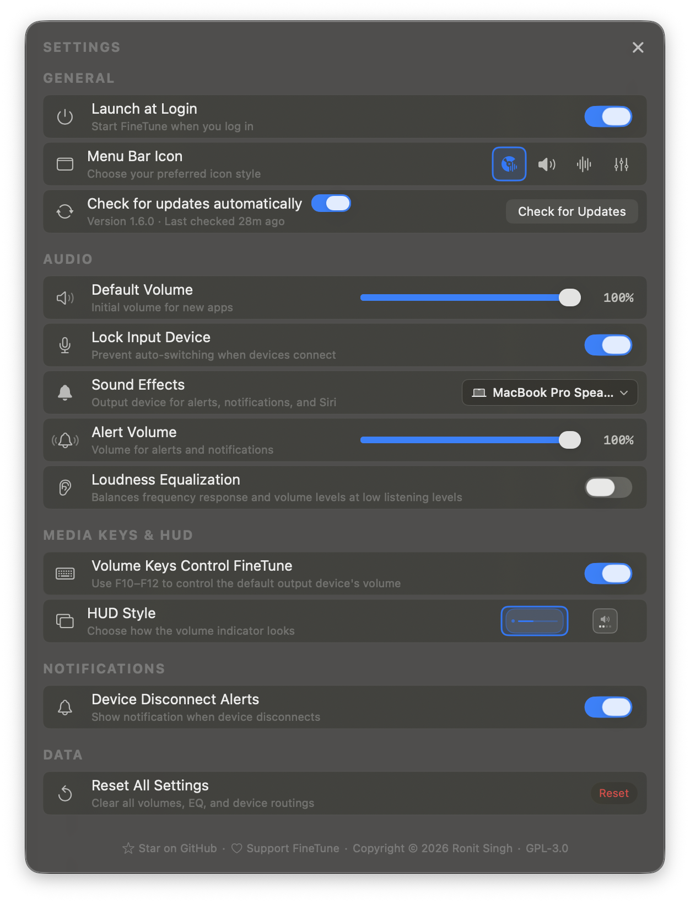

<p align="center">
  
</p>

<h1 align="center">FineTune</h1>

<p align="center">
  <strong>Per-app volume control for macOS</strong>
</p>

<p align="center">
  <a href="https://github.com/ronitsingh10/FineTune/releases/latest"></a>
  <a href="https://github.com/ronitsingh10/FineTune/releases"></a>
  <a href="LICENSE"></a>
  <a href="https://www.apple.com/macos/"></a>
</p>

<p align="center">
  The volume mixer macOS should have built in.<br>
  Free and open-source.
</p>

---

<p align="center">
  
</p>

## Features

- **Per-app volume** — Individual sliders and mute for each application
- **Multi-device output** — Route audio to multiple devices simultaneously
- **Input device control** — Monitor and adjust microphone levels
- **10-band EQ** — 20 presets across 5 categories
- **Pinned apps** — Pre-configure apps before they play
- **Audio routing** — Send apps to different outputs or follow system default
- **Volume boost** — Amplify up to 400%
- **Menu bar app** — Lightweight, always accessible
- **URL schemes** - Cross app scripting for device switching and per app volume

<p align="center">
  
  
</p>

## Install

**Homebrew** (recommended)

```bash
brew install --cask finetune
```

**Manual** — [Download latest release](https://github.com/ronitsingh10/FineTune/releases/latest)

## Why FineTune?

macOS has no built-in per-app volume control. Your music is too loud while a podcast is too quiet. FineTune fixes that:

- Turn down notifications without touching your music
- Play different apps on different speakers
- Boost quiet apps, tame loud ones
- Free forever, no subscriptions

## Requirements

- macOS 14.0 (Sonoma) or later
- Audio capture permission (prompted on first launch)

## FAQ

<details>
<summary><strong>App not appearing?</strong></summary>
Only apps actively playing audio show up. Start playback first.
</details>

<details>
<summary><strong>Volume slider not working?</strong></summary>
Some apps use helper processes. Try restarting the app.
</details>

<details>
<summary><strong>Input devices not showing?</strong></summary>
Grant microphone permission in System Settings → Privacy & Security → Microphone.
</details>

## Contributing

- ⭐ **Star this repo** — Help others discover FineTune
- 🐛 **Report bugs** — [Open an issue](https://github.com/ronitsingh10/FineTune/issues)
- 💻 **Contribute code** — See [CONTRIBUTING.md](CONTRIBUTING.md)

## Build from Source

```bash
git clone https://github.com/ronitsingh10/FineTune.git
cd FineTune
open FineTune.xcodeproj
```

## License

[GPL v3](LICENSE)
