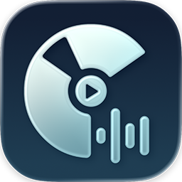
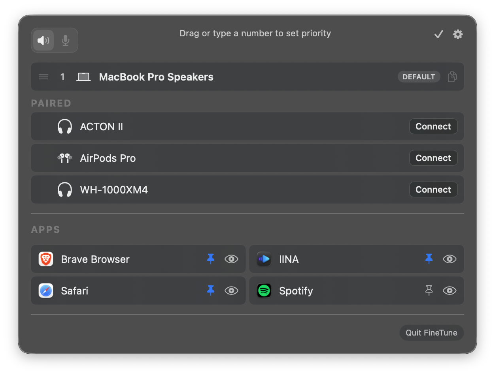
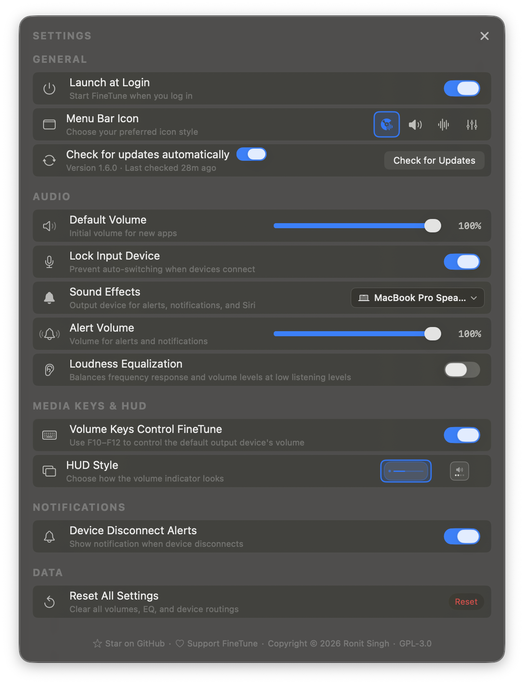

<p align="center">
  
</p>

<h1 align="center">FineTune</h1>

<p align="center">
  <strong>Per-app volume control for macOS</strong>
</p>

<p align="center">
  <a href="https://github.com/ronitsingh10/FineTune/releases/latest"></a>
  <a href="https://github.com/ronitsingh10/FineTune/releases"></a>
  <a href="LICENSE"></a>
  <a href="https://www.apple.com/macos/"></a>
</p>

<p align="center">
  The volume mixer macOS should have built in.<br>
  Free and open-source.
</p>

---

<p align="center">
  
</p>

## Features

- **Per-app volume** — Individual sliders and mute for each application
- **Multi-device output** — Route audio to multiple devices simultaneously
- **Input device control** — Monitor and adjust microphone levels
- **10-band EQ** — 20 presets across 5 categories
- **AutoEQ headphone correction** — Search thousands of headphone profiles or import your own ParametricEQ.txt files for per-device frequency response correction
- **Bluetooth device management** — See paired Bluetooth devices and connect directly from the menu bar
- **Pinned apps** — Pre-configure apps before they play
- **Ignore apps** — Hide specific apps from FineTune in edit mode
- **Audio routing** — Send apps to different outputs or follow system default
- **Monitor speaker control** — Adjust volume on external displays via DDC
- **Device priority** — Set preferred output order; auto-fallback on disconnect
- **Volume boost** — 1x / 2x / 3x / 4x gain presets per app
- **Menu bar app** — Lightweight, always accessible
- **URL schemes** — Automate volume, mute, device routing, and more from scripts

<p align="center">
  
  
</p>

## Install

**Homebrew** (recommended)

```bash
brew install --cask finetune
```

**Manual** — [Download latest release](https://github.com/ronitsingh10/FineTune/releases/latest)

## Why FineTune?

macOS has no built-in per-app volume control. Your music is too loud while a podcast is too quiet. FineTune fixes that:

- Turn down notifications without touching your music
- Play different apps on different speakers
- Boost quiet apps, tame loud ones
- Free forever, no subscriptions

## Requirements

- macOS 15.0 (Sequoia) or later
- Audio capture permission (prompted on first launch)

## AutoEQ

FineTune can apply headphone-specific frequency response corrections using profiles from the [AutoEQ](https://github.com/jaakkopasanen/AutoEq) project.

**Browse built-in profiles** — Click the wand icon next to any headphone device and search for your model. Profiles are fetched on demand and cached offline.

**Import custom profiles** — Click "Import ParametricEQ.txt..." at the bottom of the AutoEQ panel. FineTune accepts [EqualizerAPO](https://sourceforge.net/projects/equalizerapo/) ParametricEQ.txt files:

```
Preamp: -6.2 dB
Filter 1: ON PK Fc 100 Hz Gain -2.3 dB Q 1.41
Filter 2: ON LSC Fc 105 Hz Gain 7.0 dB Q 0.71
Filter 3: ON HSC Fc 8000 Hz Gain 2.1 dB Q 0.71
```

Supported filter types: `PK`/`PEQ` (peaking), `LS`/`LSC` (low shelf), `HS`/`HSC` (high shelf). Up to 10 filters per profile.

You can download ParametricEQ.txt files from [autoeq.app](https://www.autoeq.app/) — select **EqualizerAPO ParametricEq** as the equalizer app — or create your own in any text editor.

## Troubleshooting

**No sound / audio stops working?**
Grant **Screen & System Audio Recording** permission in System Settings → Privacy & Security. Restart FineTune after granting.

**App not appearing?**
Only apps actively playing audio show up. Start playback first. If an app is hidden, open edit mode (pencil icon) and look for the eye icon.

**App causing audio issues?**
Some apps (audio processors, VoIP tools) don't work well with process taps. Use edit mode to ignore the app — this tears down its tap entirely.

**Volume slider not working?**
Some apps use helper processes. Try restarting the app.

**Input devices not showing?**
Grant microphone permission in System Settings → Privacy & Security → Microphone.

## URL Schemes

Control FineTune from Terminal, shell scripts, [Shortcuts](https://support.apple.com/guide/shortcuts-mac), [Raycast](https://raycast.com), or any app that can open URLs.

### Actions

| Action | Format | Description |
|--------|--------|-------------|
| Set volume | `finetune://set-volumes?app=BUNDLE_ID&volume=PERCENT` | Set volume (0–100, or up to 400 with boost) |
| Step volume | `finetune://step-volume?app=BUNDLE_ID&direction=up` | Nudge volume up or down by ~5% |
| Set mute | `finetune://set-mute?app=BUNDLE_ID&muted=true` | Mute or unmute an app |
| Toggle mute | `finetune://toggle-mute?app=BUNDLE_ID` | Toggle mute state |
| Set device | `finetune://set-device?app=BUNDLE_ID&device=DEVICE_UID` | Route an app to a specific output |
| Reset | `finetune://reset` | Reset all apps to 100% and unmuted |

### Examples

```bash
# Set Spotify to 50% volume
open "finetune://set-volumes?app=com.spotify.client&volume=50"

# Set different volumes for different apps at once
open "finetune://set-volumes?app=com.spotify.client&volume=80&app=com.hnc.Discord&volume=40"

# Mute multiple apps at once
open "finetune://set-mute?app=com.spotify.client&muted=true&app=com.apple.Music&muted=true"

# Step Discord volume down
open "finetune://step-volume?app=com.hnc.Discord&direction=down"

# Route an app to a specific device
open "finetune://set-device?app=com.spotify.client&device=YOUR_DEVICE_UID"

# Reset everything
open "finetune://reset"
```

**Finding bundle IDs** — Run `osascript -e 'id of app "App Name"'` in Terminal. Common ones: `com.spotify.client`, `com.apple.Music`, `com.google.Chrome`, `com.hnc.Discord`.

**Finding device UIDs** — Click the pencil icon to enter edit mode, then click the copy button next to a device name.

## Contributing

- ⭐ **Star this repo** — Help others discover FineTune
- 🐛 **Report bugs** — [Open an issue](https://github.com/ronitsingh10/FineTune/issues)
- 💻 **Contribute code** — See [CONTRIBUTING.md](CONTRIBUTING.md)

## Build from Source

```bash
git clone https://github.com/ronitsingh10/FineTune.git
cd FineTune
open FineTune.xcodeproj
```

## License

[GPL v3](LICENSE)
